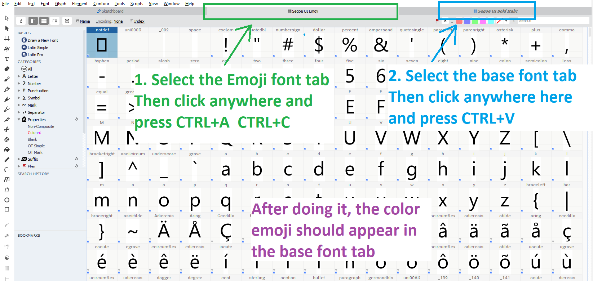
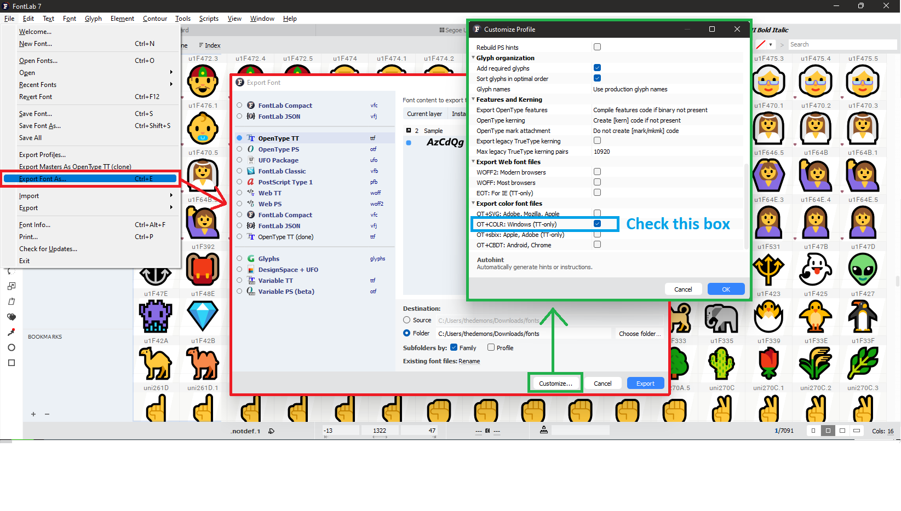
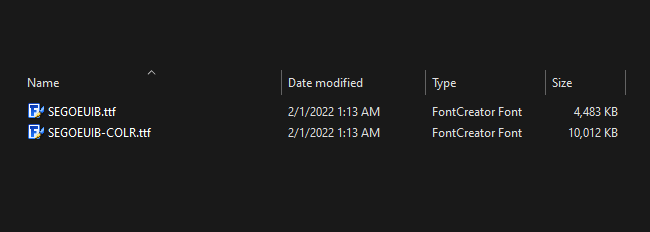

# How to merge fonts with color emoji

After 8 hours of desperately searching how to do this on the internet, I've finally found a way to merge color emoji font into a text font.

This repository is for people in the future who has the exact problem that I'm having.

This is a step-by-step tutorial to merge two fonts together while keeping the color in emojis.

## STEP 1: Download FontLab
- Download FontLab from their [official site](https://www.fontlab.com/), install and open it.

## STEP 2: Open the fonts file

- After opening FontLab, click File -> Open Fonts on the top left.
- You need to open the base font and the emoji font you want to merge.

## STEP 3: Merge the fonts
- Select the Emoji font tab you've just opened, click anywhere on the characters table.
- Press `CTRL+A` `CTRL+C` to copy the characters.
- Select the Base font tab, click anywhere on the characters table.
- Press `CTRL+V` to paste the characters you've just copied from emoji.
- A box will appear, select the `Append glyphs, keep existing glyphs unchanged` option.
- After doing this, the color emojis should appear in the Base font.

    

## STEP 4: Export the font
- Click **File -> Export Font As**
- Click the **Customize** button in the bottom right of the box.
- Scroll down and check the `OT+COLR: Windows (TT-only)` option.

    

## RESULT:
- Two .ttf files should appear in the folder that you've exported to.
- The font with `-COLR` at the end of the name is the merged font with color emoji.

    

## Downloads:
- Here are the Segoe UI fonts that I've merged, in case you need exactly these fonts, I'll leave them here for you:
    - [Segoe UI Color Emoji](./seguiemj.ttf)
    - [Segoe UI Color Emoji Bold](./seguiemj_bold.ttf)
    - [Segoe UI Color Emoji Italic](./seguiemj_italic.ttf)
    - [Segoe UI Color Emoji Bold Italic](./seguiemj_bold_italic.ttf)

tags: Fontforge, FontLab, Glyphs, Fontcreator, Fonts merge, Fonts combine, Font merge, Font combine